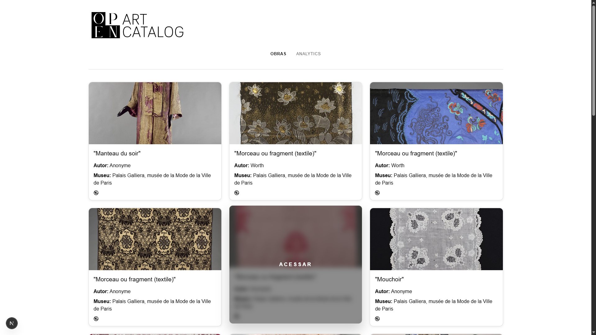
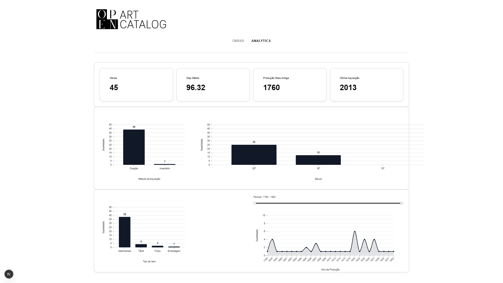

# Open Art Catalog | Paris Musées

### Projeto para descoberta, catalogação, disponibilização e análise de obras em domínio público (CC0) provenientes das coleções do Paris Musées.

## Visualização da aplicação - obras


As obras são extraídas por meio da API GraphQL do Paris Musées, enriquecidas com metadados, imagens em alta resolução e links para download, e armazenadas em PostgreSQL para consumo por uma API REST desenvolvida com FastAPI e por uma aplicação frontend construída com Next.js, React e TypeScript.

## Visualização da aplicação - analytics


Além da camada de catalogação, o projeto possui um módulo de Analytics construído a partir dos metadados do acervo. Informações como autores, períodos históricos, técnicas artísticas, categorias, museus de origem e métodos de aquisição foram transformadas e modeladas para geração de indicadores. Por meio de consultas agregadas utilizando PostgreSQL e SQLAlchemy, a aplicação disponibiliza métricas, distribuições estatísticas e análises exploratórias consumidas por dashboards interativos, permitindo identificar padrões da coleção e transformar dados culturais em informações orientadas à geração de insights.

## Stack

| Categoria | Tecnologias |
|------------|------------|
| Frontend | Next.js, React, TypeScript, Nivo |
| Backend | FastAPI, SQLAlchemy, Pydantic |
| Banco de Dados | PostgreSQL |
| Engenharia de Dados | GraphQL, Web Scraping, ETL Pipelines |
| Analytics | Dashboard Analytics, Data Visualization |
| Ferramentas | Git, GitHub, VS Code |

## Arquitetura

```text
Paris Musées (Open Data)
           │
           ▼
       API GraphQL
           │
           ▼
       Pipeline ETL
           │
           ▼
 Filtragem de Obras CC0
           │
           ▼
 Extração de Metadados
           │
           ▼
       PostgreSQL
           │
           ▼
  FastAPI + SQLAlchemy
           │
   ┌───────┴────────┐
   │                │
   ▼                ▼
Catálogo       Camada de
de Obras       Analytics
   │                │
   └───────┬────────┘
           ▼
   React + TypeScript
           │
           ▼
Visualizações das obras
e Insights Analíticos
```


## Scripts

### Importação inicial

```bash
python -m scripts.import_paris_musees
```

Importa obras da API GraphQL.

---

### Exploração GraphQL

```bash
python -m scripts.explore_graphql
```

Investiga o schema GraphQL e experimenta consultas.

---

### Importação de obras CC0

```bash
python -m scripts.import_cc0_artworks
```

Localiza obras CC0, extrai:

- título
- autor
- museu
- imagem HD
- licença
- download

e salva no PostgreSQL.

## Endpoints

### Catálogo de Obras

```http
GET /cc0-artworks
```

Retorna a coleção de obras em domínio público (CC0) catalogadas na plataforma.

```http
GET /cc0-artworks/{id}
```

Retorna os detalhes completos de uma obra específica.

```http
GET /cc0-artworks/search?q={termo}
```

Realiza buscas no catálogo por nome, autor e metadados associados.

---

### Analytics

```http
GET /analytics/summary
```

Fornece indicadores gerais da coleção, incluindo quantidade de obras, período de produção e métricas agregadas.

```http
GET /analytics/acquisition-methods
```

Retorna a distribuição de obras por método de aquisição.

```http
GET /analytics/item-types
```

Retorna a distribuição por categoria e tipo de obra.

```http
GET /analytics/production-years
```

Disponibiliza a série temporal das obras por ano de produção.

```http
GET /analytics/centuries
```

Retorna a distribuição das obras por século de produção.


## Estrutura de Dados

| Tabela | Finalidade |
|---------|------------|
| cc0_artworks | Catálogo principal contendo obras em domínio público, imagens em alta resolução e links para download. |
| cc0_artworks_analytics | Camada analítica com informações de produção, aquisição, século e categoria das obras. |

### Fluxo dos Dados

```text
cc0_artworks
        │
        ▼
Transformação dos Metadados
        │
        ▼
cc0_artworks_analytics
        │
        ▼
Endpoints Analytics
        │
        ▼
Dashboard Analytics
```

## Instalação

### 1. Clonar o repositório

```bash
git clone https://github.com/brunorrmachado/musees-digital-catalog.git

cd musees-digital-catalog
```

### 2. Configurar o Backend

```bash
cd backend

python -m venv .venv

# Linux / MacOS
source .venv/bin/activate

# Windows
.venv\Scripts\activate

pip install -r requirements.txt
```

### 3. Configurar as variáveis de ambiente

Crie um arquivo `.env` baseado no modelo:

```bash
cp .env.example .env
```

Exemplo:

```env
DB_HOST=localhost
DB_PORT=5432
DB_NAME=Paris_Musees
DB_USER=postgres
DB_PASSWORD=sua_senha
API_TOKEN=seu_token_aqui
```

### 4. Criar as tabelas

```bash
python scripts/create_db.py
```

### 5. Executar o pipeline ETL

```bash
python -m scripts.import_cc0_artworks
```

### 6. Iniciar a API

```bash
uvicorn app.main:app --reload
```

Swagger:

```txt
http://localhost:8000/docs
```

### 7. Iniciar o Frontend

```bash
cd frontend

npm install

npm run dev
```

Aplicação:

```txt
http://localhost:3000
```


